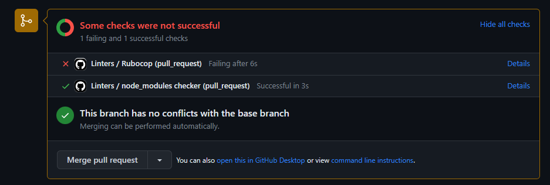
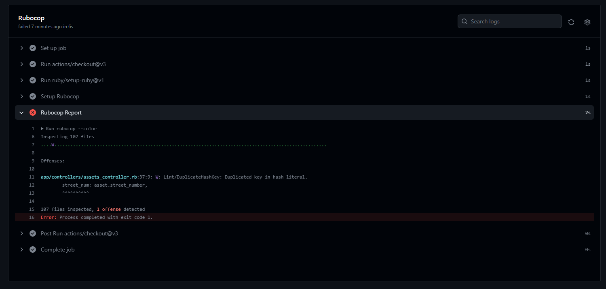
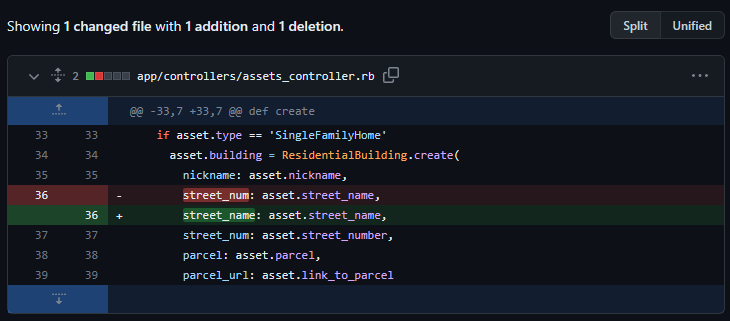
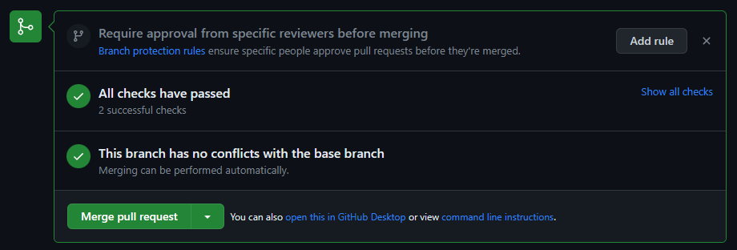

# Linters Configuration

This repository contains onfiguration files and implementation instructions for the static code analyzers (linters) used by the **Borluv Developments** team.

## How to use this repository? 🤷

Each directory listed below contains configuration files and a `README.md` file with detailed instructions for one programming language or framework:

- [Ruby on Rails](./ruby-on-rails/)
- [TypeScript + Sass](./vanilla-ts-sass/)
- [React + Sass](./react-sass)
- [React + TypeScript + Sass](./react-ts-sass/)
- [Next + Sass](./next-sass/)

Follow those instructions in order to set up linters or validators in your repo.

In order to get to know more about linters and GitHub Actions read the recap below.

## Linters
A linter is a tool that analyzes your source code to flag programming errors, bugs, stylistic errors, and suspicious constructs (source: [Wikipedia](https://en.wikipedia.org/wiki/Lint_(software))).

There are a few reasons for using linters:

1. Catching syntax errors is more efficient.
2. There is no need to debug simple mistakes like typos - the linter does it for you.
3. The entire codebase looks like written by one person.
4. Programmers can focus on solving problems, instead of cleaning up the code.

---

## Linter Checks in GitHub Actions

[Github Actions](https://help.github.com/en/actions) is a [CI/CD](https://codilime.com/what-is-ci-cd-all-you-need-to-know/) service offered by GitHub. It allows you to automate your workflow by letting GitHub take care of a number of tasks which can be triggered by [different of events](https://help.github.com/en/actions/reference/events-that-trigger-workflows) on the platform.

You can automate tasks by creating **workflows** in your GitHub repository. GitHub will look for [YAML](https://en.wikipedia.org/wiki/YAML) files inside of the `.github/workflows` directory.

### See In Action

1. When you open your first pull request you should see the result of the GitHub Actions:

2. Click on the **Details** link to see the full output and the errors that need to be fixed before merging:

3. Fix the errors:

4. After fixing the error and pushing again you should see your checks pass. This will let you merge your Pull Request to the codebase:

> NOTE: in some cases GitHub Actions will automatically prevent you from merging your branch. However, in some cases you will need to configure this automation manually through your project's branch protection rules.
